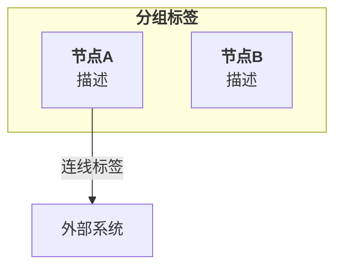
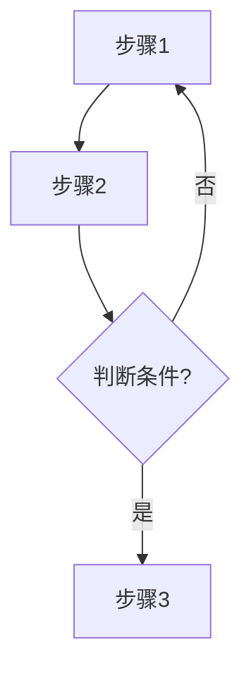
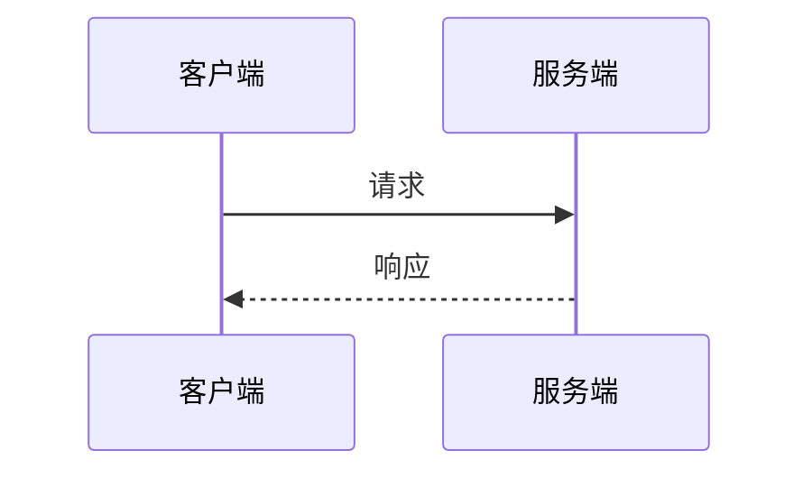
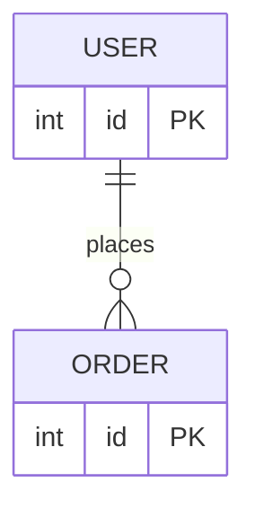
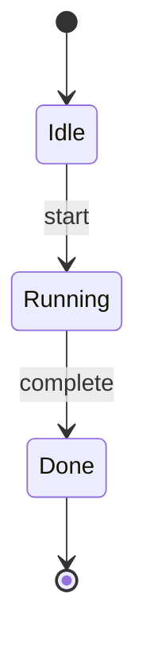

# 设计配图协议

## 输出格式选择

| 场景 | 格式 | 理由 |
|------|------|------|
| markdown 文档配图 | **Mermaid** | GitHub 原生渲染，零依赖，text-based diff 友好 |
| 独立图表文件 | **Mermaid** 嵌入 md 或用 `.mmd` 文件 | 同上 |
| 复杂精细排版 | **draw.io XML** | Mermaid 布局能力有限时用 |

**默认用 Mermaid**。只有 Mermaid 实在排不出来（节点定位要求精确、多层嵌套容器、自定义形状）才降级到 draw.io。

## 铁律

```
设计文档里该有图的地方，不准用文字凑合。直接出 Mermaid 图。
```

## 何时出图

以下场景**必须**生成配图，不要等用户开口：

| 场景 | 出什么图 | 时机 |
|------|---------|------|
| 讨论系统架构 | 架构图 | 说了"架构"两个字就出 |
| 描述业务流程/算法 | 流程图 | 流程超过 3 步就出 |
| 讲服务调用/消息传递 | 时序图 | 涉及 2 个以上组件交互 |
| 数据库/实体设计 | ER 图 | 提到表结构、实体关系 |
| 状态机/生命周期 | 状态机图 | 提到状态转换 |
| 知识梳理/概念拆解 | 思维导图 | 需要结构化呈现概念 |
| 写 Plan | 按内容选 | Plan 的 Architecture 部分必出图 |

**原则**：宁可多出一张没用的图让用户删，也不该出的时候没出。

## Mermaid 配色规范

将 draw.io 色板映射到 Mermaid `style` 指令：

| 语义类别 | 填充色 | 用途 |
|---------|--------|------|
| Business Service | `#E99151` | 核心业务服务、数据处理节点 |
| Infrastructure | `#7C3AED` | LLM、基础设施服务 |
| Gateway/Entry | `#005D7B` | 判断节点、入口点 |
| Client/Frontend | `#0891B2` | 前端、外部接口 |
| Info/Neutral | `#94A3B8` | I/O 操作、配置、Sleep 等辅助步骤 |
| Success | `#4CA497` | 最终输出、成功状态 |
| Alert/Danger | `#DC2626` | 异常流、"有环"分支 |
| External | `#64748B` | 外部系统、第三方 |

**Mermaid style 模板**：
```
style nodeId fill:#E99151,stroke:none,color:#fff
```

## Mermaid 图表模板

### 架构图 → `graph TB`（上到下）+ `subgraph` 分组



### 流程图 → `flowchart TB` + 菱形判断



### 时序图 → `sequenceDiagram`



### ER 图 → `erDiagram`



### 状态机图 → `stateDiagram-v2`



## 生成协议

### 第一步：分析需求 + 选格式

- Mermaid 能表达 → 用 Mermaid（90% 的情况）
- Mermaid 排不出 → 降级到 draw.io XML（参考 `references/design-spec.md`）

### 第二步：选图类型 + 布局

按速查表选 Mermaid 图表类型（graph / flowchart / sequenceDiagram / erDiagram / stateDiagram-v2）。

### 第三步：写出 Mermaid 代码

- 配色严格用上面的 style 映射
- 节点标签用 `<b>` 加粗标题
- 中文内容直接写，特殊字符（`\`）注意转义
- 连线标签精简（≤6 个字）

### 第四步：嵌入文档

直接在 markdown 中写 ` ```mermaid ` 代码块，不要生成独立文件。

### 第五步：告知

告诉用户在文档的哪个位置嵌入了什么图。

## 停止信号

- 准备用 ASCII art 代替图 —— 停，出 Mermaid
- 准备用文字描述架构 —— 停，出图
- 纠结 Mermaid 布局不够精确 —— 可以接受，先出 Mermaid。只有实在排不出才降级 draw.io
- 不知道该出什么类型的图 —— 默认出架构图（`graph TB` + `subgraph`）
