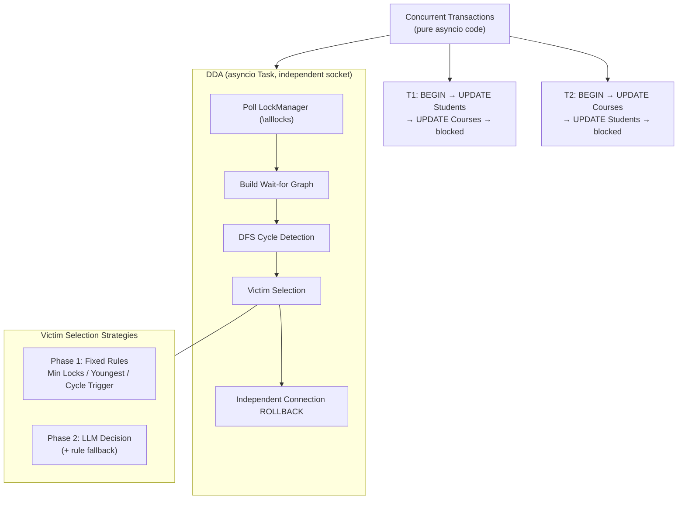

[中文](README.md) | [English](README_EN.md)

# DDA — DB Deadlock Agent

**Using LLMs to replace hardcoded kernel rules for deadlock victim selection.**

rookieDB is an educational relational database with a full multi-granularity lock system but no deadlock detection. DDA runs externally, polling the LockManager state, building a wait-for graph, detecting deadlock cycles, then using an LLM to analyze context, select a victim, and provide a natural language explanation — instead of silently killing a transaction with a hardcoded rule like MySQL/PostgreSQL do.

## Core Proposition

> Can we outsource deadlock detection logic from the database kernel to AI?

Every major database uses hardcoded rules for victim selection:

| Database | Rule |
|----------|------|
| MySQL | Rollback the one with the smallest undo log |
| PostgreSQL | Rollback the one that closed the cycle |
| CockroachDB | Rollback the one with the lowest priority |
| Oracle | Rollback the one that triggered the deadlock |
| SQL Server | Rollback the one with the lowest `DEADLOCK_PRIORITY` |

**Not a single database can explain "why I killed you" in natural language. DDA can.**

## Architecture



DDA uses a **Sidecar architecture**: it runs as an independent process outside the database kernel, polling lock state externally. This means it is not tied to any specific database — in the deep-dive roadmap, PostgreSQL support only requires swapping the data source from `\alllocks` to `pg_locks` + `pg_stat_activity`, while all other logic (graph construction, cycle detection, victim selection) is fully reusable.

## Two Implementation Phases

### Phase 1: Traditional Algorithm Baseline

Implement three fixed rules from major databases, run them on the same scenario, and compare output — establishing a comparison baseline.

### Phase 2: LLM Replacement

Replace fixed rules with LLM decision-making on the same scenario, comparing against Phase 1. The LLM provides a "reasoned decision," not a cold transaction ID.

## Quick Start

```bash
# 1. Start rookieDB
cd /path/to/rookiedb
java -cp target/classes edu.berkeley.cs186.database.cli.Server &

# 2. Install dependencies
pip install -r requirements.txt

# 3. Configure environment
cp .env.example .env
# Edit .env, fill in ANTHROPIC_API_KEY

# 4. Run
python dda_basic.py
```

## File Structure

```
dda/
├── dda_basic.py          # Main program
├── scenarios.py          # Deadlock scenario orchestration (concurrent transactions)
├── test_components.py    # Component-level unit tests
├── test_integration.py   # Integration tests (full pipeline with rookieDB)
├── pyproject.toml        # Project config (dependencies, linting)
├── requirements.txt
├── LICENSE
├── scenarios/            # YAML scenario files
├── .claude/              # Claude Code config (skills, settings)
├── docs/
│   ├── requirements.md   # Background, functional requirements, roadmap, acceptance criteria
│   ├── requirements_EN.md # English version ↑
│   ├── design.md         # Architecture, data flow, component interfaces, LLM prompt design
│   ├── design_EN.md       # English version ↑
│   ├── decisions.md      # Key design decisions — tradeoffs and conclusions
│   └── decisions_EN.md    # English version ↑
├── README.md             # Chinese
└── README_EN.md          # English
```

## Related Projects

- [rookieDB](https://github.com/ShunheWang/berkeley-sp26-rookiedb) — The data source for this project. Built on UC Berkeley CS186 skeleton code, extended with `LockManager.getAllLockInfo()`, `\alllocks` metacommand, and other helper methods to support DDA's lock state collection
- [maison-ai-learning-sandbox](https://github.com/shunhewang/maison-ai-learning-sandbox) — The learning precursor to this project, containing Multi-Agent study notes, Orchestrator-Worker demos, and deadlock scenario reproduction experiments

## References

Core knowledge sources this project builds upon:

| Article | Key Takeaways |
|---------|---------------|
| [Building Effective Agents](https://www.anthropic.com/research/building-effective-agents) (Anthropic) | Agent design philosophy: Workflows vs Agents, when not to use LLMs, 6 orchestration patterns (Prompt Chaining, Routing, Parallelization, etc.) |
| [Multi-Agent Research System](https://www.anthropic.com/engineering/multi-agent-research-system) (Anthropic) | Orchestrator-Worker in practice, Subagent single-responsibility principle, performance data (90.2% improvement), production challenges |
| [Claude Agent Patterns](https://github.com/anthropics/claude-cookbooks/issues/303) | Quick reference for 7 agent patterns: Subagent Orchestration, Prompt Chaining, Parallelization, Evaluator-Optimizer, Routing, Master-Clone, Programmatic Orchestration |
| [ai-agents-for-beginners](https://github.com/microsoft/ai-agents-for-beginners) (Microsoft) | Lessons 3-8: Agentic Design Patterns, Tool Use, Multi-Agent collaboration patterns (6 building blocks including Hand-off, Collaborative Filtering) |
| [mcp-for-beginners](https://github.com/microsoft/mcp-for-beginners) (Microsoft) | MCP protocol core concepts: Server/Client architecture, three primitives (Tool/Resource/Prompt), JSON-RPC 2.0 message layer |
| [Claude Agent SDK Best Practices](https://skywork.ai/blog/claude-agent-sdk-best-practices-ai-agents-2025/) | Production practices: principle of least privilege (each Agent gets only necessary tools), context isolation, error isolation |