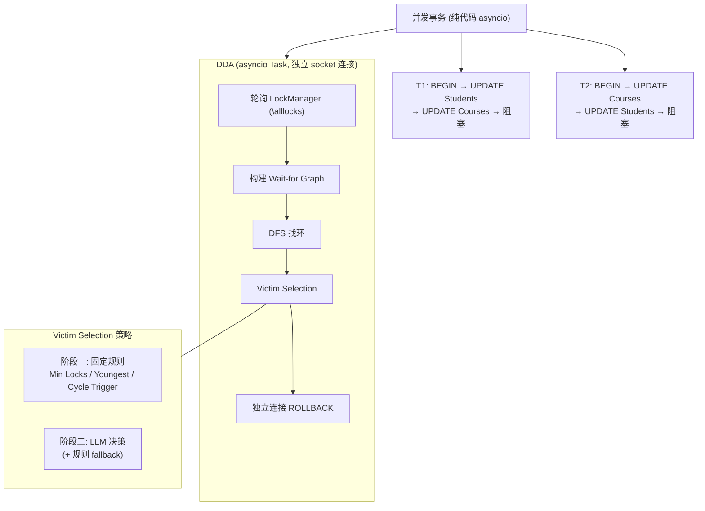

[中文](decisions.md) | [English](decisions_EN.md)

# DDA 设计决策记录

> 记录每个重大决策的背景、博弈过程、结论。

---

## 决策 1: 砍掉 Worker Agent

**日期**：2026-06-10

**背景**：项目原设计是 Orchestrator → Worker A + B（两个 LLM Agent）→ rookieDB → DDA。Worker Agent 负责接收任务、生成 SQL、执行、恢复。

**博弈**：

Worker Agent 理论上的价值：
- 被回滚后的"自主恢复"——分析失败原因（死锁 vs SQL 语法错误 vs 表不存在）、决定重试策略
- 自然语言驱动的工作负载——用户说"同时更新学生表和课程表"，Agent 拆任务、生成 SQL

但在 DDA 场景中：
- 死锁是精心编排的——A 先锁 Students 再锁 Courses，B 反着来。SQL 步骤写死
- Worker Agent 每执行一步固定 SQL 调一次 LLM，LLM 说"好的我执行完了"，继续下一步。这不是智能，是浪费 token
- Orchestrator-Worker 和并发 Agent 两种模式已在学习阶段独立验证过

**结论**：砍掉 Worker Agent。并发事务用纯 asyncio 代码执行。DDA 是唯一用到 LLM 的地方（victim selection）。

**要点**：一开始设计了 Multi-Agent 架构，但分析后发现 Worker 只是执行固定 SQL，LLM 没做任何实质决策。主动砍掉——不是所有地方都需要 Agent，确定性代码做确定性的事。

---

## 决策 2: 不做 DDA 多 Agent 拆分

**日期**：2026-06-10

**背景**：学过 Hand-off 模式后，设计过将 DDA 拆成三个 Agent（Detector → Analyzer → Executor）。Detector 找环、Analyzer 选 victim、Executor 回滚+通知。

**博弈**：

单 DDA 已包含所有三个环节的逻辑。拆分的价值只在复杂场景下成立：
- 多个死锁环并发（Detector 持续找环，多个 Analyzer 并行分析）
- 不同 Analyzer 用不同策略（Collaborative Filtering 汇总裁决）
- Detector 和 Executor 部署在不同进程/节点

当前场景只有 2 个事务、1 个死锁环。拆分后三个 Agent 串行执行，跟单 DDA 一个函数调三个子函数没区别，多了 Agent 间交接的复杂度。

**结论**：单 DDA。拆分思路记录在案，证明了对多 Agent 拆分适用场景和边界的理解。

**要点**：Hand-off 模式适合多步骤、每个步骤有独立上下文的任务。但当前场景太简单，拆分创造复杂度而不是解决复杂度。如果将来有多死锁并发场景，再引入拆分。

---

## 决策 3: 不加 Orchestrator 编排层

**日期**：2026-06-10

**背景**：最外层设计是 Orchestrator Agent——用户自然语言 → 拆任务 → 分派 Worker → 汇总返回。

**博弈**：

Orchestrator 的价值在于自然语言驱动的动态任务分配。DDA 场景没有自然语言入口，没有 Worker Agent（决策 1 已砍），没有需要编排的动态任务。Orchestrator-Worker 模式已在学习阶段独立验证过。

**结论**：不加 Orchestrator。项目聚焦死锁检测本身，不追求"端到端自然语言驱动"的大而全。

---

## 决策 4: 直接上 LLM Victim Selection，不做纯代码过渡版

**日期**：2026-06-10

**背景**：最初计划 v1 用纯代码规则（最少锁 → 更大事务 ID）跑通链路，v2 加 LLM。

**博弈**：

纯代码规则不需要验证——MySQL/PostgreSQL/CockroachDB 已做了几十年。做一个"我也实现了 MySQL 的规则"的 demo 没有增量价值。LLM victim selection 才是唯一现有数据库没做过的事，是核心亮点。

LLM 调用可能失败，需要兜底——LLM 做主决策 + 规则 fallback 两者共存。

**结论**：直接上 LLM。阶段一实现三种固定规则作为对比基线，阶段二 LLM 替换后同场景对比。

**要点**：所有数据库的 victim selection 都是固定规则。验证的是 LLM 能不能做得更好——先跑三种传统规则出基线数据，再让 LLM 来做，直接对比。

---

## 决策 5: 先实现主流固定规则，再对比 LLM

**日期**：2026-06-10

**背景**：要验证 LLM 能否替代固定规则，需要先有"固定规则是什么"的精确基线。

**方案**：

| 阶段 | 内容 | 产出 |
|------|------|------|
| 阶段一 | 三种固定规则（Min Locks / Youngest First / Cycle Trigger）| 对比数据——各选了哪个 victim |
| 阶段二 | LLM 替换固定规则，同场景对比 | LLM vs 传统规则的决策差异 |

**产出**：数据 + 对比表格。

---

## DDA 最终架构

