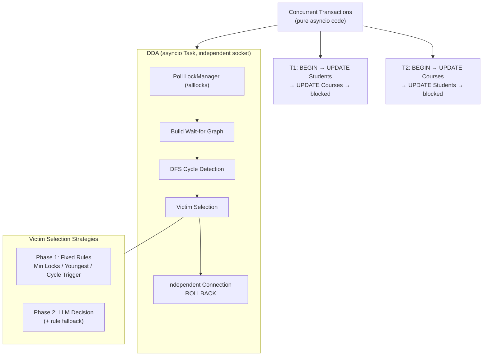

[中文](decisions.md) | [English](decisions_EN.md)

# DDA Design Decision Records

> Recording the background, tradeoff analysis, and conclusions for each major design decision.

---

## Decision 1: Cutting the Worker Agent

**Date**: 2026-06-10

**Background**: The original design was Orchestrator → Worker A + B (two LLM Agents) → rookieDB → DDA. Worker Agents were responsible for receiving tasks, generating SQL, executing, and recovering.

**Tradeoff Analysis**:

The theoretical value of Worker Agents:
- "Autonomous recovery" after rollback — analyzing failure causes (deadlock vs. SQL syntax error vs. table doesn't exist), deciding retry strategies
- Natural-language-driven workload — user says "update both the Students and Courses tables," the Agent decomposes tasks and generates SQL

But in the DDA scenario:
- Deadlocks are choreographed — A locks Students then Courses, B goes the other way. SQL steps are fixed
- Every time Worker Agent executes a fixed SQL statement, it calls the LLM; the LLM says "OK, I executed it," then continues to the next step. This isn't intelligence — it's wasting tokens
- The Orchestrator-Worker and concurrent Agent patterns were already independently validated during the learning phase

**Conclusion**: Cut Worker Agents. Concurrent transactions use pure asyncio code. DDA is the only place where the LLM is used (victim selection).

**Key Point**: The initial design had a Multi-Agent architecture, but analysis revealed Workers only execute fixed SQL — the LLM makes no real decisions. Proactively cut it — not everything needs an Agent. Deterministic code for deterministic tasks.

---

## Decision 2: No Multi-Agent Split for DDA

**Date**: 2026-06-10

**Background**: After learning the Hand-off pattern, a design was sketched splitting DDA into three Agents (Detector → Analyzer → Executor). Detector finds cycles, Analyzer selects victims, Executor rolls back and notifies.

**Tradeoff Analysis**:

A single DDA already contains all three steps. The value of splitting only materializes in complex scenarios:
- Multiple concurrent deadlock cycles (Detector continuously finds cycles, multiple Analyzers work in parallel)
- Different Analyzers with different strategies (Collaborative Filtering aggregates verdicts)
- Detector and Executor deployed on separate processes/nodes

The current scenario has only 2 transactions and 1 deadlock cycle. Splitting into three Agents executing serially is no different from one DDA function calling three sub-functions — it only adds inter-Agent hand-off complexity.

**Conclusion**: Single DDA. The split design is recorded as proof of understanding the applicability and boundaries of Multi-Agent decomposition.

**Key Point**: The Hand-off pattern suits tasks with multiple steps, each having independent context. But the current scenario is too simple — splitting creates complexity rather than solving it. Introduce the split when there are genuinely concurrent multi-cycle scenarios.

---

## Decision 3: No Orchestrator Layer

**Date**: 2026-06-10

**Background**: The outermost design included an Orchestrator Agent — natural language → task decomposition → dispatch to Workers → aggregate results.

**Tradeoff Analysis**:

The Orchestrator's value lies in natural-language-driven dynamic task assignment. The DDA scenario has no natural language entry point, no Worker Agents (Decision 1 already cut them), and no dynamic tasks requiring orchestration. The Orchestrator-Worker pattern was independently validated during the learning phase.

**Conclusion**: No Orchestrator. The project focuses on deadlock detection itself, not an "end-to-end natural-language-driven" everything-system.

---

## Decision 4: Go Straight to LLM Victim Selection, Skip Pure-Code Transition Version

**Date**: 2026-06-10

**Background**: The initial plan was v1 with pure code rules (fewest locks → larger transaction ID) to establish the pipeline, then v2 with LLM.

**Tradeoff Analysis**:

Pure code rules don't need validation — MySQL/PostgreSQL/CockroachDB have been doing it for decades. Building a demo that says "I also implemented MySQL's rule" has zero incremental value. LLM victim selection is the only thing no existing database has done — it is the core differentiator.

LLM calls can fail and need a fallback — LLM as primary decision-maker + rule fallback, both coexisting.

**Conclusion**: Go straight to LLM. Phase 1 implements three fixed rules as a comparison baseline; Phase 2 replaces them with LLM for same-scenario comparison.

**Key Point**: Every database's victim selection is hardcoded. What we're testing is whether LLM can do better — first produce baseline data from three traditional rules, then let the LLM take over, and compare directly.

---

## Decision 5: Implement Mainstream Fixed Rules First, Then Compare with LLM

**Date**: 2026-06-10

**Background**: To verify whether LLM can replace fixed rules, we first need a precise baseline of "what fixed rules do."

**Approach**:

| Phase | Content | Output |
|-------|---------|--------|
| Phase 1 | Three fixed rules (Min Locks / Youngest First / Cycle Trigger) | Comparison data — which victim each picked |
| Phase 2 | LLM replaces fixed rules, same-scenario comparison | LLM vs. traditional rule decision differences |

**Output**: Data + comparison tables.

---

## DDA Final Architecture

