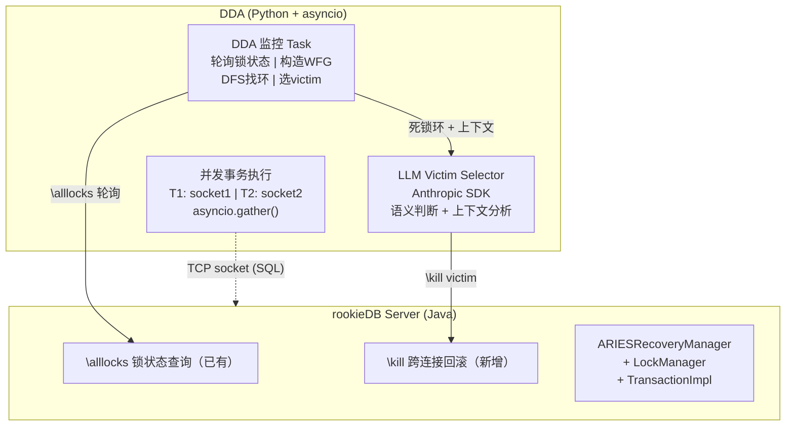
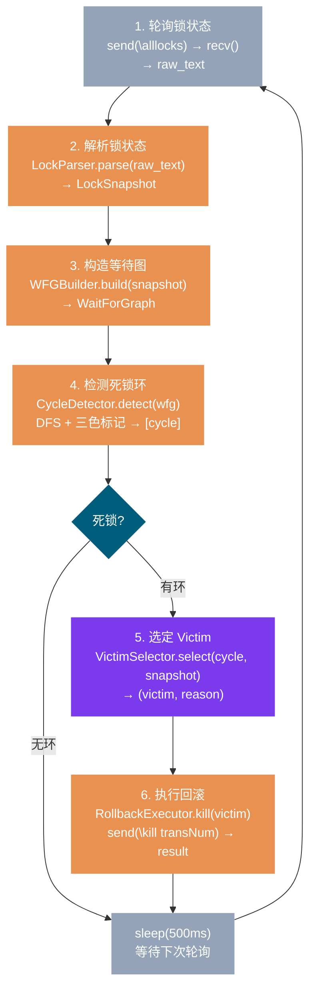

[中文](design.md) | [English](design_EN.md)

# DDA 设计文档

> 状态：完成
> 最后更新：2026-06-12

---

## 1. 系统架构



> **关键边界**：
> - LLM 只在 victim selection 一个环节调用
> - 其他所有环节（SQL 执行、锁状态解析、WFG 构造、DFS 找环、ROLLBACK 执行）纯代码
> - DDA 通过独立 TCP socket 连接运行，不嵌入 rookieDB 内核

---

## 2. rookieDB 能力补全

> DDA 需要、但 rookieDB 当前不提供的能力。讨论于 2026-06-11。

### 2.1 跨连接事务回滚（`\kill`）

**问题**：rookieDB 的事务是 ThreadLocal 的。每个连接的 Transaction 对象只存在于自己线程的上下文中（`TransactionContext.threadTransactions` 以 `Thread.getId()` 为 key）。DDA 作为独立连接，无法访问或回滚其他连接的事务。

**设计思路**：Database 增加事务注册表（transNum → TransactionImpl 映射），提供一个公开的回滚方法。回滚执行在 DDA 线程，但操作的目标是全局共享的 LockManager（线程安全）。

#### 2.1.1 事务注册表

**位置**：`Database.java`

新增 `Map<Long, TransactionImpl> transactionRegistry`，使用 `ConcurrentHashMap`（多线程并发：一个连接注册事务、DDA 连接回滚事务）。

- `beginTransaction()` 完成构造后注册
- `cleanup()` 末尾移除

#### 2.1.2 rollbackTransaction(long transNum)

**位置**：`Database.java`（新增公开方法）

DDA 调用的入口。执行顺序：

1. **清理等待队列**：调用 `LockManager.removeFromAllQueues(transNum)`，移除被 kill 事务在所有资源等待队列中的 `LockRequest`
2. **回滚**：调用 `t.rollback()`，走正规 ARIES 路径（abort → end → 释放锁）
3. **唤醒线程**：调用 `ctx.unblock()`，如果目标事务的线程正卡在 `TransactionContext.block()` 里，将其唤醒

#### 2.1.3 ARIES.end() 顺序修复

**位置**：`ARIESRecoveryManager.java` 第 192-193 行

**问题**：当前代码先调 `transaction.cleanup()` 再调 `setStatus(COMPLETE)`。`TransactionImpl.cleanup()` 内部调用 `recoveryManager.end(transNum)`，形成递归。ARIES 单元测试用 `DummyTransaction`（其 `cleanup()` 不调 `end()`），因此测试能过而生产炸。

**修法**：两行换位——先 `setStatus(COMPLETE)` 再 `cleanup()`。`TransactionImpl.cleanup()` 首行检查 `COMPLETE` 后直接返回，递归终结。

#### 2.1.4 等待队列清理

**位置**：`LockManager.java`（新增方法）

被 kill 的事务可能正在 LockManager 的资源等待队列中排队（请求锁被阻塞）。正常 rollback 只释放已持有的锁，不会从等待队列移除。需要新增 `removeFromAllQueues(long transNum)` 遍历所有 `ResourceEntry.waitingQueue`，移除该事务。

该方法是 `synchronized` 的，与 `acquire`/`release`/`promote` 互斥，保证线程安全。

#### 2.1.5 跨线程 ThreadLocal 清理

**位置**：`TransactionContext.java`

**问题**：`unsetTransaction()` 通过 `Thread.currentThread().getId()` 定位线程。回滚在 DDA 线程执行时，拿到的线程 ID 是 DDA 的，不是被 kill 事务的，导致无法清理或清理错误目标。

**修法**：新增 `unsetTransaction(long transNum)` 重载，按 transNum 在 `threadTransactions` 中查找并移除。原无参版本保留不动，其他调用方不受影响。

`TransactionContext.close()` 内改用 transNum 版本调用。

#### 2.1.6 `\kill` metacommand

**位置**：`CommandLineInterface.java`

新增 metacommand：`\kill <transNum>`。解析并调用 `db.rollbackTransaction(transNum)`。该命令从 DDA 连接执行，不需要当前连接持有事务。

#### 2.1.7 已知边界：竞态窗口

`\kill` 存在一个理论竞态窗口：DDA 从 `transactionRegistry` 拿到目标事务后、调用 `rollback()` 前，目标事务可能恰好自然完成（锁被释放、正常 commit）。此时 `t.rollback()` 抛出 `IllegalStateException`（"transaction not in running state"），`ctx.unblock()` 走不到。

**实际不会触发**：DDA 只在 `\alllocks` 确认死锁后才发 `\kill`。victim 事务一定处于 `block()` 等待状态（`Status.RUNNING`），不可能在 kill 的短短几毫秒内"刚好自己完成"。如果死锁已经自行解除，kill 失败反而是正确行为——不需要回滚一个没有死锁的事务。

### 2.2 事务启动时间

**问题**：阶段一的 Youngest First 规则需要知道"谁是最年轻的事务"。当前 `TransactionImpl` 不记录创建时间。虽可通过 `transNum` 间接推导（按创建顺序递增），但这是隐式依赖实现细节，不够明确。

**设计**：

- `TransactionImpl` 构造时记录 `System.currentTimeMillis()`，新增 `getStartTime()` 访问器
- `Database` 新增 `getTransactionTimes()`，返回 `Map<Long, Long>`（transNum → startTime）
- CLI 的 `\alllocks` 调用 `db.getAllLockInfo()`（Database 包装方法），输出中附加事务时间信息

**职责边界**：事务时间不放在 `LockManager` 输出中——LockManager 不感知 Transaction 对象。由 `Database` 做聚合，CLI 做格式拼接。

### 2.3 改动范围汇总

| 文件 | 改动 | 类型 |
|------|------|------|
| `Database.java` | 事务注册表 + `rollbackTransaction()` + `getTransactionTimes()` + `getAllLockInfo()` 包装 + TransactionImpl 时间字段 | 新增 |
| `ARIESRecoveryManager.java` | `end()` 内两行换位 | 修复 |
| `LockManager.java` | `removeFromAllQueues()` | 新增 |
| `TransactionContext.java` | `unsetTransaction(long)` 重载 | 新增 |
| `CommandLineInterface.java` | `\kill` case + `\alllocks` 调新方法 | 新增/修改 |

**不变的部分**：`Lock`/`LockRequest.toString()` 格式、ARIES abort/commit/restart 流程、Server 多线程模型、`\alllocks` 原有输出字段。

---

## 3. DDA 端设计

> 状态：完成
> 最后更新：2026-06-12

### 3.1 整体数据流

PollingMonitor 是一个 asyncio Task，以 500ms 间隔循环执行：



### 3.2 数据结构

#### 3.2.1 LockSnapshot

从 `\alllocks` 文本解析出的结构化锁状态快照。

```python
@dataclass
class HeldLock:
    """一个已授予的锁"""
    trans_num: int
    lock_type: str    # S | X | IS | IX | SIX
    resource: str     # 如 "db://tableA"


@dataclass
class WaitingRequest:
    """等待队列中的一个锁请求"""
    trans_num: int
    lock_type: str
    resource: str


@dataclass
class LockSnapshot:
    """一次 \alllocks 查询的完整快照"""
    held_locks: dict[int, list[HeldLock]]
    # trans_num → 该事务持有的所有锁

    waiting: dict[str, list[WaitingRequest]]
    # resource → 该资源的等待队列（保持 \alllocks 顺序，队首在前）

    trans_times: dict[int, int]
    # trans_num → 事务启动时间 (epoch ms)

    raw_text: str
    # 原始输出文本，阶段二 LLM 需要上下文时使用
```

**数据来源**：

| 字段 | 来源 |
|------|------|
| `held_locks` | resourceEntries 的 Active Locks |
| `waiting` | resourceEntries 的 Queue |
| `trans_times` | transactionTimes 行 |
| `raw_text` | 整个 `\alllocks` 输出 |

注意：`held_locks` 从 resourceEntries 构造而非 transactionLocks 行。两者等价（都是 LockManager.transactionLocks 的内容），但从 resourceEntries 提取可以一次遍历构造 held_locks + waiting，少一遍解析。

#### 3.2.2 WaitForGraph

```python
@dataclass
class WaitForGraph:
    """等待图：有向图，边 waiter → holder 表示 waiter 在等 holder 释放锁"""
    nodes: set[int]                  # 所有活跃事务的 transNum
    edges: list[tuple[int, int]]     # (waiter, holder)
```

死锁 = WFG 中存在有向环。

#### 3.2.3 Cycle

```python
@dataclass
class Cycle:
    """WFG 中的一个环"""
    transactions: list[int]  # 环上事务序列，如 [1, 2, 1] 表示 T1 → T2 → T1
```

### 3.3 LockParser

**职责**：将 `\alllocks` 原始文本解析为 `LockSnapshot`。

**输入格式**（见第 2 节 rookieDB 实现）：

```
=== LockManager State ===
transactionLocks: {1=[T1: X(db://tableA)], 2=[T2: X(db://tableB)]}
resourceEntries:
  db://tableA => Active Locks: [T1: X(db://tableA)], Queue: [Request for T2: X(db://tableA) (releasing [])]
  db://tableB => Active Locks: [T2: X(db://tableB)], Queue: [Request for T1: X(db://tableB) (releasing [])]
transactionTimes: {1=1718150400000, 2=1718150400100}
```

**解析规则**：

| 行类型 | 正则 | 提取 |
|--------|------|------|
| Lock（持有/请求） | `T(\d+):\s*(\w+)\((.+?)\)` | transNum, lockType, resource |
| WaitingRequest | `Request for T(\d+):\s*(\w+)\((.+?)\)\s*\(releasing` | transNum, lockType, resource |
| transactionTimes | `(\d+)=(\d+)` | transNum, startTime |

**解析流程**：

1. 按行分割文本
2. 匹配 `resourceEntries:` 后进入资源解析模式
3. 每行格式：`resource => Active Locks: [...], Queue: [...]`
   - 从左半提取 resource name
   - 从 Active Locks 提取 HeldLock 列表
   - 从 Queue 提取 WaitingRequest 列表
4. 匹配 `transactionTimes: {` 行，提取所有 `key=value` 对
5. 从 HeldLock 反向构建 `held_locks` 索引（trans_num → list[HeldLock]）

**错误处理**：解析失败（格式异常）返回 `None`，调用方跳过本轮轮询。格式由 rookieDB 端固定输出保证稳定性——不解析可变格式。

### 3.4 WFGBuilder

**职责**：从 LockSnapshot 构造 WaitForGraph。

**算法**：

```
输入: LockSnapshot
输出: WaitForGraph

nodes = 所有在 held_locks 或 waiting 中出现过的 transNum
edges = []

for each resource, waiters in snapshot.waiting:
    holders = snapshot.held_locks 中持有该 resource 的事务
    
    for each waiter in waiters:
        for each holder_lock in holders:
            if waiter.trans_num == holder.trans_num:
                continue  # 不等自己
            
            if 锁类型冲突(waiter.lock_type, holder_lock.lock_type):
                edges.append((waiter.trans_num, holder_lock.trans_num))
```

**边构造决策**（第 4 个讨论结论）：等待者只连持有者，不连队列前面的其他等待者。rookieDB 的 `processQueue()` 只检查与持有者的兼容性，队列位置 ≠ 依赖关系。

**锁兼容性矩阵**（复制 rookieDB 定义）：

```
         NL  IS  IX  S   SIX X
NL       ✓   ✓   ✓   ✓   ✓   ✓
IS       ✓   ✓   ✓   ✓   ✓   ✗
IX       ✓   ✓   ✓   ✗   ✗   ✗
S        ✓   ✓   ✗   ✓   ✗   ✗
SIX      ✓   ✓   ✗   ✗   ✗   ✗
X        ✓   ✗   ✗   ✗   ✗   ✗
```

两个锁类型冲突 ⇔ 表中对应格子为 ✗。DDA 端硬编码此矩阵（7 种锁类型包含 NL（无锁），共 49 个单元格）。

**为什么需要精确冲突检查**：如果等待者 W 在队列中只因为与持有者 H1 冲突，而 H2 持有兼容锁，W→H2 是虚假依赖，可能产生假环。精确检查保证每条边都对应真实的锁冲突。

**复杂度**：O(|resources| × |waiters| × |holders|)。阶段一场景规模下（≤5 事务，≤10 资源）可以忽略。

### 3.5 CycleDetector

**职责**：在 WFG 中检测有向环。

**算法**：DFS + 颜色标记。

```
输入: WaitForGraph
输出: list[Cycle]

WHITE = 0  # 未访问
GRAY  = 1  # 当前递归栈中
BLACK = 2  # 已完成探索

def detect(wfg):
    cycles = []
    color = {node: WHITE for node in wfg.nodes}

    def dfs(u, path):
        color[u] = GRAY
        path.append(u)

        for (v, w) in wfg.edges:   # u → w（u 等 w）
            if v != u:
                continue
            if color[w] == GRAY:   # 找到环
                cycle_start = path.index(w)
                cycles.append(Cycle(path[cycle_start:] + [w]))
            elif color[w] == WHITE:
                dfs(w, path)

        path.pop()
        color[u] = BLACK

    for node in wfg.nodes:
        if color[node] == WHITE:
            dfs(node, [])

    return cycles
```

**多环处理**（第 4 个讨论结论）：`detect()` 返回找到的所有环，但 PollingMonitor 只取第一个环的返回值。其余环在后续轮询中处理——回滚 victim 后 WFG 变化，下一轮自然检测残留。

**复杂度**：O(V + E)，V = 事务数，E = 边数。

**确定性**：死锁检测是纯图算法，不依赖 LLM。输出是确定性的——同一个 LockSnapshot 总是产生相同的 cycles 列表。

### 3.6 VictimSelector（策略模式）

**设计**：Strategy 模式——统一接口，多种可选实现。阶段一实现三种固定规则（MinLocks、YoungestFirst、CycleTrigger），阶段二加 LLM 实现，无需改调用方。

```python
class VictimSelector(ABC):
    """Victim 选择策略接口"""

    @abstractmethod
    def select(self, cycle: Cycle, snapshot: LockSnapshot) -> tuple[int, str]:
        """
        从死锁环中选定一个 victim。

        Args:
            cycle: 死锁环
            snapshot: 当前锁状态快照

        Returns:
            (victim_trans_num, reason)
            reason 是人类可读的选择理由（用于终端输出和对比分析）
        """
        ...
```

**调用方**（PollingMonitor）只依赖接口，不感知具体策略：

```python
# 策略切换
selector = MinLocksSelector()       # 或 YoungestFirstSelector()
victim, reason = selector.select(cycle, snapshot)
```

#### 3.6.1 MinLocksSelector

**规则**：回滚持有锁数量最少的事务。

```
select(cycle, snapshot):
    candidates = cycle.transactions
    lock_counts = {t: len(snapshot.held_locks.get(t, [])) for t in candidates}
    victim = min(candidates, key=lambda t: lock_counts[t])
    reason = f"T{victim} holds {lock_counts[victim]} lock(s) — fewest among cycle members"
    return (victim, reason)
```

**对应数据库**：MySQL (InnoDB)——回滚代价最小的。

**平局**：多个事务持有相同最少锁数时，选 transNum 最小的（确定性）。

#### 3.6.2 YoungestFirstSelector（阶段一实现）

**规则**：回滚最晚开始的事务。

```
select(cycle, snapshot):
    candidates = cycle.transactions
    victim = max(candidates, key=lambda t: snapshot.trans_times.get(t, 0))
    reason = f"T{victim} started at {snapshot.trans_times[victim]} — youngest in cycle"
    return (victim, reason)
```

**对应数据库**：CockroachDB——回滚优先级最低/最年轻的。

**平局**：startTime 相同时选 transNum 最大的（确定性）。

#### 3.6.3 CycleTriggerSelector

**规则**：回滚环上在资源等待队列中最后出现的那个事务——即触发本轮死锁检测的事务。

```
select(cycle, snapshot):
    # 遍历环上每个事务，找到在各资源 waiting 队列中位置最靠后的
    candidates = cycle.transactions
    last_in_queue = max(candidates, key=lambda t: snapshot.get_queue_position(t))
    reason = f"T{last_in_queue} is last in request queue — cycle trigger"
    return (last_in_queue, reason)
```

**对应思路**：Percona/MariaDB 的"最后请求者优先"——打破最新形成的等待关系，与锁等待的自然时序一致。

**平局**：多个事务在队列中处于相同位置时，选 transNum 最大的（确定性）。

> **状态**：已设计，待实现。阶段一初始实现先跑 MinLocks 和 YoungestFirst，CycleTrigger 在后续迭代中接入。

#### 3.6.4 LLMSelector（阶段二接入点）

阶段二实现，接口预留：

```python
class LLMSelector(VictimSelector):
    def __init__(self, client: anthropic.Anthropic, fallback: VictimSelector):
        self.client = client
        self.fallback = fallback  # LLM 失败时兜底

    def select(self, cycle: Cycle, snapshot: LockSnapshot) -> tuple[int, str]:
        # 阶段二实现：
        # 1. 构造 Prompt（cycle 上下文 + snapshot 信息）
        # 2. 调用 Anthropic API
        # 3. 解析响应，提取 victim + reason
        # 4. 失败时 fallback.select(cycle, snapshot)
        ...
```

### 3.7 RollbackExecutor

**职责**：通过 TCP 连接向 rookieDB 发送 `\kill` 命令，回滚 victim 事务。

```
输入: victim_trans_num (int), host, port
输出: bool（成功/失败）

async def kill(trans_num, host, port):
    1. 打开到 rookieDB 的 TCP 连接（或复用 DDA 的连接）
    2. 发送 "\kill {trans_num}\n"
    3. 读取响应
    4. 关闭连接
    5. 返回 True（响应包含 "rolled back"） / False（其他）
```

**设计决策**：每次 kill 打开新连接还是复用 DDA 轮询连接？选**复用**——DDA 的 `\alllocks` 和 `\kill` 共用同一个 TCP 连接，减少建立/断开开销。rookieDB Server 的多线程模型为每个连接分配独立线程，复用不影响隔离性。

**错误场景**：

| 场景 | 原因 | 处理 |
|------|------|------|
| 连接断开 | rookieDB 重启 | 重连 + 重试 |
| `\kill` 返回非 "rolled back" | 事务已自然完成（竞态） | 日志警告，下轮轮询确认 |
| transNum 不存在 | registry 中已移除 | 日志警告，不重试 |

### 3.8 PollingMonitor

**职责**：asyncio 主循环，组装整个流水线，管理 DDA 生命周期。

```python
class PollingMonitor:
    def __init__(
        self,
        host: str = "localhost",
        port: int = 18600,
        interval: float = 0.5,          # 轮询间隔（秒）
        selector: VictimSelector | None = None,
    ):
        self.host = host
        self.port = port
        self.interval = interval
        self.selector = selector or MinLocksSelector()  # 阶段一跑三种策略，选哪个由调用方注入
        self.parser = LockParser()
        self.builder = WFGBuilder()
        self.detector = CycleDetector()
        self.executor = RollbackExecutor(host, port)

    async def run(self, stop_event: asyncio.Event):
        """主循环。stop_event 由外部设置以停止监控。"""
        cycle_num = 0

        while not stop_event.is_set():
            cycle_num += 1
            # 1. 轮询锁状态
            raw_text = await self._poll()
            if raw_text is None:
                continue  # 轮询失败，下轮重试

            # 2. 解析
            snapshot = self.parser.parse(raw_text)
            if snapshot is None:
                continue

            # 3. 构造 WFG
            wfg = self.builder.build(snapshot)

            # 4. 检测死锁
            cycles = self.detector.detect(wfg)
            if not cycles:
                self._log_cycle(cycle_num, wfg, snapshot, "no deadlock")
                await asyncio.sleep(self.interval)
                continue

            # 5. 取第一个环，选 victim
            cycle = cycles[0]
            victim, reason = self.selector.select(cycle, snapshot)

            # 6. 回滚
            success = await self.executor.kill(victim)
            self._log_cycle(cycle_num, wfg, snapshot, reason, success)

            # 7. 等待下次轮询
            await asyncio.sleep(self.interval)

    async def _poll(self) -> str | None:
        """发送 \alllocks，返回原始文本。失败返回 None。"""
        ...
```

**启动方式**：

```python
async def main():
    strategies = [MinLocksSelector(), YoungestFirstSelector(), CycleTriggerSelector()]
    for selector in strategies:
        stop_event = asyncio.Event()
        monitor = PollingMonitor(selector=selector)
        async with asyncio.TaskGroup() as tg:
            tg.create_task(monitor.run(stop_event))
            tg.create_task(run_scenario())   # scenarios.py 中的场景
        # 对比三种策略的 victim + reason
```

**与并发事务的关系**：DDA 和并发事务共享同一个 asyncio 事件循环。并发事务在独立 TCP 连接上执行 SQL，DDA 在自己的连接上轮询和杀事务。当并发事务因锁冲突阻塞时，asyncio 的 await 挂起不占 CPU，事件循环继续调度 DDA 任务。DDA 不需要抢占或中断——它的轮询逻辑和事务的 SQL 执行天然并发。

### 3.9 错误处理策略

| 组件 | 错误 | 策略 |
|------|------|------|
| PollingMonitor._poll() | TCP 连接失败/超时 | 等 interval 后重试，最多连续 3 次失败后退出 |
| LockParser | 解析失败（格式异常） | 日志警告 + 跳过本轮，下轮重试 |
| WFGBuilder | — | 纯数据变换，无外部依赖，不会失败 |
| CycleDetector | — | 纯图算法，确定性的，不会失败 |
| VictimSelector (fixed) | — | 纯计算，确定性的，不会失败 |
| VictimSelector (LLM) | API 超时/错误 | fallback 到固定规则（阶段二实现） |
| RollbackExecutor | \kill 失败 | 日志警告，不重试，下轮轮询确认状态 |

**总体原则**：DDA 的单次轮询失败不影响后续轮询。宁可错过一轮，不让整个监控进程挂掉。

### 3.10 可观测性

**需求**（来自 requirements.md）：终端实时输出轮询状态、图结构、victim 选择理由、回滚结果。

**输出设计**——每个轮询周期一行摘要，有死锁时展开：

```
[Cycle #1] 2 active txn(s), 0 waiting — no deadlock
[Cycle #2] 2 active txn(s), 2 waiting — no deadlock
[Cycle #3] DEADLOCK DETECTED
  Cycle: T1 → T2 → T1
  WFG:
    T1 holds [X(db://tableA)], waits [X(db://tableB)] → T2
    T2 holds [X(db://tableB)], waits [X(db://tableA)] → T1
  Victim: T2 | Strategy: MinLocks
  Reason: T2 holds 1 lock(s) — fewest among cycle members
  Rollback: ✓ T2 rolled back
[Cycle #4] 1 active txn(s), 0 waiting — no deadlock
  → T1 committed successfully
```

**常规轮询**：一行摘要（事务数、等待者数），不刷屏。
**检测到死锁**：展开完整的图结构、策略名、选择理由、回滚结果。
**阶段二对比输出**：同一场景跑两个策略后输出对比表格（具体格式阶段二定）。

### 3.11 Scenarios（并发事务编排）

**职责**：制造死锁场景，驱动 DDA 检测。独立文件 `scenarios.py`，不混入 DDA 框架代码。

**接口约定**：每个 scenario 是一个 async 函数，接受 `(host, port)`，返回执行结果摘要。

```python
async def two_transaction_deadlock(host: str, port: int) -> dict:
    """
    T1: UPDATE tableA → UPDATE tableB
    T2: UPDATE tableB → UPDATE tableA
    形成 T1→T2→T1 死锁环
    """
    ...
    return {
        "scenario": "two_transaction_deadlock",
        "t1_committed": bool,
        "t2_committed": bool,
        "victim": int | None,
    }
```

**事务脚本模式**：每个事务是一个 async 函数，内部：
1. 打开 TCP 连接
2. 发送 SQL（BEGIN → DML → COMMIT）
3. 捕获回滚错误（被 kill 的事务收到错误，正常退出）
4. 关闭连接

**场景与 DDA 的协作**：主函数 `main()` 中用 `asyncio.TaskGroup` 同时启动 PollingMonitor 和 scenario，scenario 跑完后设 `stop_event` 停止监控。

---

## 4. 实施顺序

rookieDB 能力补全（本文第 2 节）→ DDA 端设计（第 3 节）→ 阶段一：传统算法 + 对比基线 → 阶段二：LLM Victim Selection