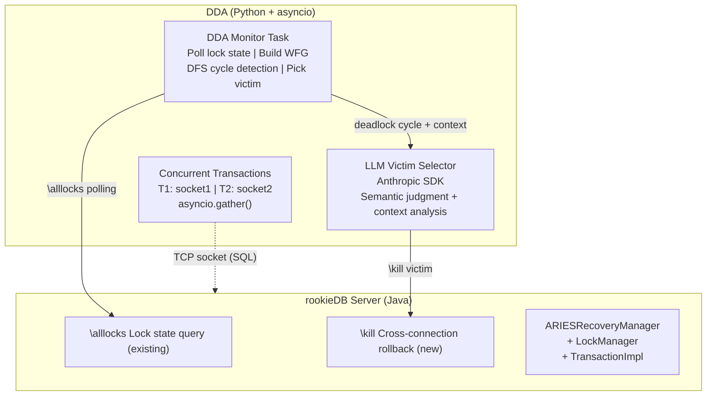
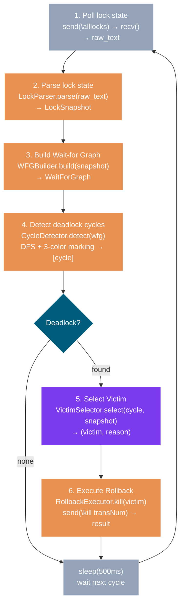

[中文](design.md) | [English](design_EN.md)

# DDA Design Document

> Status: Complete
> Last updated: 2026-06-12

---

## 1. System Architecture



> **Key boundaries:**
> - LLM is only invoked for victim selection
> - All other steps (SQL execution, lock state parsing, WFG construction, DFS cycle detection, ROLLBACK execution) are pure code
> - DDA runs via an independent TCP socket connection, not embedded in the rookieDB kernel

---

## 2. rookieDB Capability Additions

> Capabilities DDA needs that rookieDB currently lacks. Discussed on 2026-06-11.

### 2.1 Cross-Connection Transaction Rollback (`\kill`)

**Problem:** rookieDB transactions are ThreadLocal. Each connection's Transaction object exists only within its own thread context (`TransactionContext.threadTransactions` keyed by `Thread.getId()`). DDA, as an independent connection, cannot access or rollback other connections' transactions.

**Design approach:** Database gains a transaction registry (transNum → TransactionImpl mapping) and exposes a public rollback method. Rollback executes on DDA's thread but operates on the globally shared LockManager (which is thread-safe).

#### 2.1.1 Transaction Registry

**Location:** `Database.java`

Add `Map<Long, TransactionImpl> transactionRegistry` using `ConcurrentHashMap` (multi-threaded concurrent access: one connection registers transactions, DDA connection rolls them back).

- `beginTransaction()` registers after construction
- `cleanup()` removes at the end

#### 2.1.2 rollbackTransaction(long transNum)

**Location:** `Database.java` (new public method)

DDA's entry point. Execution order:

1. **Clean wait queues:** Call `LockManager.removeFromAllQueues(transNum)` to remove the victim's pending lock requests from all resource queues
2. **Rollback:** Call `t.rollback()`, following the normal ARIES path (abort → end → release locks)
3. **Unblock thread:** Call `ctx.unblock()` to wake the victim thread if it's stuck in `TransactionContext.block()`

#### 2.1.3 ARIES.end() Order Fix

**Location:** `ARIESRecoveryManager.java` lines 192-193

**Problem:** The current code calls `transaction.cleanup()` before `setStatus(COMPLETE)`. `TransactionImpl.cleanup()` internally calls `recoveryManager.end(transNum)`, causing recursion. ARIES unit tests use `DummyTransaction` (whose `cleanup()` does NOT call `end()`), so tests pass but production breaks.

**Fix:** Swap the two lines — set `COMPLETE` first, then call `cleanup()`. `TransactionImpl.cleanup()`'s first line checks for `COMPLETE` and returns immediately, breaking the recursion.

#### 2.1.4 Wait Queue Cleanup

**Location:** `LockManager.java` (new method)

A killed transaction may have pending `LockRequest` entries in resource waiting queues (blocked requesting locks). Normal rollback only releases held locks, not queued requests. Add `removeFromAllQueues(long transNum)` to iterate all `ResourceEntry.waitingQueue` entries and remove those belonging to the victim.

This method is `synchronized`, mutually exclusive with `acquire`/`release`/`promote`, ensuring thread safety.

#### 2.1.5 Cross-Thread ThreadLocal Cleanup

**Location:** `TransactionContext.java`

**Problem:** `unsetTransaction()` locates the thread via `Thread.currentThread().getId()`. When rollback executes on DDA's thread, the thread ID belongs to DDA, not the victim, causing failure or wrong cleanup target.

**Fix:** Add `unsetTransaction(long transNum)` overload that searches by transNum in `threadTransactions`. The original no-arg version is preserved for other callers. `TransactionContext.close()` switches to the transNum version.

#### 2.1.6 `\kill` Metacommand

**Location:** `CommandLineInterface.java`

New metacommand: `\kill <transNum>`. Parses and calls `db.rollbackTransaction(transNum)`. Executed from DDA's connection — no transaction required on the calling connection.

#### 2.1.7 Known Edge Case: Race Window

`\kill` has a theoretical race window: after DDA retrieves the target transaction from `transactionRegistry` but before `rollback()` executes, the target could coincidentally finish naturally (lock released, normal commit). In this case, `t.rollback()` throws `IllegalStateException` ("transaction not in running state"), and `ctx.unblock()` is never reached.

**Not triggerable in practice:** DDA only issues `\kill` after confirming a deadlock via `\alllocks`. The victim transaction is guaranteed to be in `block()` waiting state (`Status.RUNNING`), and cannot "just happen to finish" within the few milliseconds of kill execution. If the deadlock has already resolved itself, the kill failing is the correct behavior — there is no need to rollback a transaction that isn't deadlocked.

### 2.2 Transaction Start Time

**Problem:** Phase 1's Youngest First rule needs to identify "which transaction is youngest." `TransactionImpl` currently records no creation time. While `transNum` is assigned in monotonically increasing order (implying later creation for larger numbers), this is an implicit dependency on implementation details and not sufficiently explicit.

**Design:**

- `TransactionImpl` records `System.currentTimeMillis()` at construction; new `getStartTime()` accessor
- `Database` adds `getTransactionTimes()`, returning `Map<Long, Long>` (transNum → startTime)
- CLI's `\alllocks` calls `db.getAllLockInfo()` (Database wrapper method), which appends transaction time info to the output

**Responsibility boundary:** Transaction times are not placed in `LockManager` output — LockManager has no awareness of Transaction objects. `Database` handles aggregation; CLI handles formatting.

### 2.3 Change Summary

| File | Change | Type |
|------|--------|------|
| `Database.java` | Transaction registry + `rollbackTransaction()` + `getTransactionTimes()` + `getAllLockInfo()` wrapper + TransactionImpl time fields | New |
| `ARIESRecoveryManager.java` | Swap two lines in `end()` | Fix |
| `LockManager.java` | `removeFromAllQueues()` | New |
| `TransactionContext.java` | `unsetTransaction(long)` overload | New |
| `CommandLineInterface.java` | `\kill` case + `\alllocks` call update | New/Modify |

**Unchanged:** `Lock`/`LockRequest.toString()` format, ARIES abort/commit/restart flow, Server multi-threaded model, existing `\alllocks` output fields.

---

## 3. DDA-Side Design

> Status: Complete
> Last updated: 2026-06-12

### 3.1 Overall Data Flow



Six pure-code components in a pipeline. LLM only enters at the VictimSelector stage (Phase 2), the rest is deterministic.

### 3.2 Data Structures

#### LockSnapshot

Parsed from `\alllocks` output. Contains 3 structured fields + raw text:

```python
@dataclass
class HeldLock:
    trans_num: int
    lock_type: str    # S | X | IS | IX | SIX
    resource: str

@dataclass
class WaitingRequest:
    trans_num: int
    lock_type: str
    resource: str

@dataclass
class LockSnapshot:
    held_locks: dict[int, list[HeldLock]]
    waiting: dict[str, list[WaitingRequest]]
    trans_times: dict[int, int]       # transNum → startTime (epoch ms)
    raw_text: str                     # original output for LLM context in Phase 2
```

Data source: `held_locks` and `waiting` both extracted from `resourceEntries` section; `trans_times` from the `transactionTimes` line.

#### WaitForGraph

```python
@dataclass
class WaitForGraph:
    nodes: set[int]
    edges: list[tuple[int, int]]  # (waiter, holder)
```

Deadlock ⇔ directed cycle in WFG.

#### Cycle

```python
@dataclass
class Cycle:
    transactions: list[int]  # e.g., [1, 2, 1] = T1 → T2 → T1
```

### 3.3 LockParser

Parses `\alllocks` raw text into LockSnapshot.

Input example:
```
=== LockManager State ===
transactionLocks: {1=[T1: X(db://tableA)], 2=[T2: X(db://tableB)]}
resourceEntries:
  db://tableA => Active Locks: [T1: X(db://tableA)], Queue: [Request for T2: X(db://tableA) (releasing [])]
  db://tableB => Active Locks: [T2: X(db://tableB)], Queue: [Request for T1: X(db://tableB) (releasing [])]
transactionTimes: {1=1718150400000, 2=1718150400100}
```

Regex rules:
- Lock: `T(\d+):\s*(\w+)\((.+?)\)`
- WaitingRequest: `Request for T(\d+):\s*(\w+)\((.+?)\)\s*\(releasing`
- transactionTimes: `(\d+)=(\d+)`

Parse failure → return `None`, caller skips this polling cycle. Output format is fixed by rookieDB implementation — we don't parse variable formats.

### 3.4 WFGBuilder

Constructs WaitForGraph from LockSnapshot.

Algorithm: for each resource's waiting queue, for each waiter W, for each holder H of that resource → if W ≠ H and W.lock_type conflicts with H.lock_type → add edge (W.trans_num, H.trans_num).

Edge construction decision: only connect to holders, not to other waiters ahead in queue. rookieDB's `processQueue()` checks compatibility with holders only — queue position ≠ dependency.

Lock compatibility matrix (replicates rookieDB definition):
```
         NL  IS  IX  S   SIX X
NL       ✓   ✓   ✓   ✓   ✓   ✓
IS       ✓   ✓   ✓   ✓   ✓   ✗
IX       ✓   ✓   ✓   ✗   ✗   ✗
S        ✓   ✓   ✗   ✓   ✗   ✗
SIX      ✓   ✓   ✗   ✗   ✗   ✗
X        ✓   ✗   ✗   ✗   ✗   ✗
```
Hard-coded in DDA. Conflict ⇔ ✗ in table.

Why precise conflict check: if waiter W is only blocked by holder H1 (conflicts), but H2 holds a compatible lock, W→H2 would be a false dependency potentially creating phantom cycles.

### 3.5 CycleDetector

DFS with 3-color marking (WHITE/GRAY/BLACK). Deterministic graph algorithm — no LLM involved.

Returns all cycles found. PollingMonitor only processes the first cycle per round; remaining cycles are handled in subsequent polling rounds after the victim is rolled back (WFG changes, next round naturally catches leftovers).

Complexity: O(V + E).

### 3.6 VictimSelector (Strategy Pattern)

```python
class VictimSelector(ABC):
    @abstractmethod
    def select(self, cycle: Cycle, snapshot: LockSnapshot) -> tuple[int, str]:
        """Returns (victim_trans_num, reason)."""
        ...
```

#### MinLocksSelector (Phase 1)
Rollbacks the transaction with fewest held locks. Ties → lowest transNum wins.
Analogous to MySQL (InnoDB).

#### YoungestFirstSelector (Phase 1)
Rollbacks the transaction with latest startTime. Ties → highest transNum wins.
Analogous to CockroachDB.

#### LLMSelector (Phase 2 entry point)
Interface reserved. Constructor takes `(client, fallback)`. Falls back to a fixed rule on API failure.

### 3.7 RollbackExecutor

Sends `\kill <transNum>\n` over TCP to rookieDB. Reuses DDA's polling connection. Returns `bool`.

Error scenarios: connection lost → reconnect + retry; kill fails (transaction already completed — race) → log warning, next poll confirms.

### 3.8 PollingMonitor

asyncio main loop orchestrating the pipeline. Configuration: host, port, polling interval (default 500ms), VictimSelector strategy.

Runs as an asyncio task alongside concurrent transactions (in `scenarios.py`). They share the event loop — when a transaction blocks on a SQL lock, the asyncio await suspends it, and the event loop continues scheduling the DDA monitor.

### 3.9 Error Handling

| Component | Error | Strategy |
|-----------|-------|----------|
| _poll() | TCP connection failure/timeout | Retry after interval, exit after 3 consecutive failures |
| LockParser | Parse failure | Log warning, skip this cycle |
| WFGBuilder | — | Pure data transform, never fails |
| CycleDetector | — | Pure algorithm, deterministic, never fails |
| VictimSelector (fixed) | — | Pure computation, never fails |
| VictimSelector (LLM) | API timeout/error | Fallback to fixed rule (Phase 2) |
| RollbackExecutor | \kill failure | Log warning, no retry, next poll confirms |

Guiding principle: a single polling cycle failure must not crash the monitor. Better to miss one round than to lose the entire monitoring process.

### 3.10 Observability

Normal polling: one-line summary per cycle (active txn count, waiter count).
Deadlock detected: expanded output with WFG visualization, strategy name, victim reason, rollback result.
Phase 2: side-by-side comparison table of LLM vs fixed rule decisions.

### 3.11 Scenarios (Concurrency Orchestration)

Independent file `scenarios.py`, separate from DDA framework. Each scenario is an async function accepting `(host, port)`, returning a results dict.

Transaction pattern: open TCP connection → BEGIN → DML → (block on lock, until DDA kills or resolves) → COMMIT or catch rollback error → close.

Launched alongside PollingMonitor via `asyncio.TaskGroup` in `main()`.

---

## 4. Implementation Order

rookieDB capability additions (Section 2) → DDA-side design (Section 3) → Phase 1: Traditional algorithms + baseline comparison → Phase 2: LLM Victim Selection
