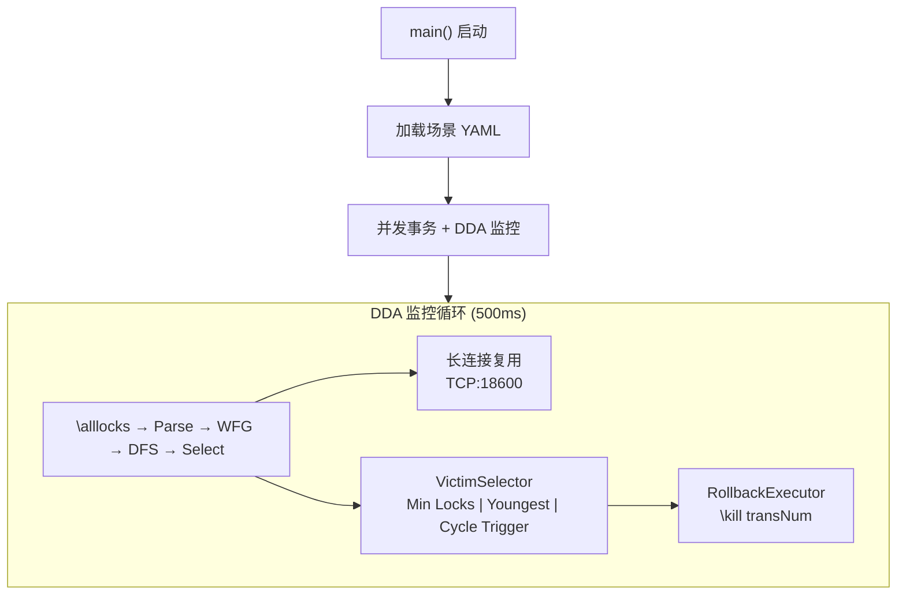
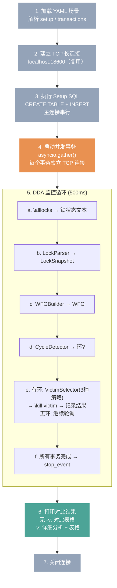

# DDA 阶段一设计规格

> 状态：已确认，待实施
> 日期：2026-06-12
> 范围：经典两事务死锁 → 三种固定规则 victim selection → 对比输出

## 1. 架构



**数据流**: YAML → 并发事务 → \alllocks → LockSnapshot → WFG(有向图) → DFS 找环 → Victim → \kill

**技术约束**: Python 3 + asyncio + 标准库 + pyyaml + anthropic(阶段二才用)

## 2. 场景文件格式 (YAML)

```yaml
name: "场景名称"
description: "场景描述"
setup:
  - CREATE TABLE ...
  - INSERT INTO ...
transactions:
  - id: T1
    steps:
      - sql: UPDATE ...
        pause: 500        # 可选，上一步执行后等待的毫秒数
      - sql: UPDATE ...   # 最后一步自动 COMMIT
  - id: T2
    steps:
      - ...
```

- `setup`: 主连接串行执行，建表插数据
- `transactions`: 每个 = 独立 TCP 连接 + asyncio task
- 每个事务自动包裹 BEGIN/COMMIT
- `pause`: step 之间可选延迟，用于控制时序造死锁

## 3. 组件

### 3.1 PollingMonitor
- 职责: 500ms 间隔通过长连接发送 `\alllocks`，接收原始文本响应
- 输入: 无（定时触发）
- 输出: 原始文本字符串
- 连接: 启动时建立 TCP 长连接，所有 metacommand 复用

### 3.2 LockParser
- 职责: 正则解析 `\alllocks` 原始文本 → LockSnapshot
- 输入: `\alllocks` 响应字符串
- 输出: `LockSnapshot` dataclass
  - `transaction_locks: dict[int, list[LockInfo]]` — transNum → 持有的锁
  - `resource_entries: dict[str, ResourceState]` — 资源名 → {holders: list, waiters: list}
  - `transaction_times: dict[int, int]` — transNum → startTime

### 3.3 WFGBuilder
- 职责: LockSnapshot → Wait-for Graph（有向图）
- 输入: LockSnapshot
- 输出: 邻接表 `dict[int, set[int]]`，边 T_a → T_b 表示 T_a 等待 T_b 释放锁

### 3.4 CycleDetector
- 职责: DFS 在有向图中找环
- 输入: WFG 邻接表
- 输出: `Optional[list[int]]` — 环上事务列表，无环返回 None

### 3.5 VictimSelector
- 职责: 三种策略选定 victim
- 输入: LockSnapshot + 环事务列表
- 输出: `VictimResult` dataclass
  - `victim: int` — 被选中的 transNum
  - `strategy: str`
  - `reason: str` — 自然语言理由
- 三种策略:
  - **Min Locks**: `transaction_locks` 中锁数最少的
  - **Youngest First**: `transaction_times` 中 startTime 最大的
  - **Cycle Trigger**: 环上在 `resource_entries` Queue 中最后出现的

### 3.6 RollbackExecutor
- 职责: 通过长连接发送 `\kill <transNum>`
- 输入: victim transNum
- 输出: 执行结果

## 4. 主流程



## 5. 验收标准

- 死锁发生后 ≤1.5s 检测到（500ms × 3 个周期）
- 选定 victim 后 ≤500ms 完成 ROLLBACK
- 三种策略输出可对比
- 回滚后非 victim 事务继续执行并提交
- 被 kill 事务收到错误信息
- `python dda_basic.py` 一键启动，全程无手动干预
- 终端实时输出轮询状态、图结构、victim 选择、结果

## 6. 文件结构

```
dda/
├── dda_basic.py              # 主入口
├── scenarios/
│   └── deadlock_2tx_basic.yaml   # 第一个死锁场景
├── requirements.txt          # +pyyaml
└── docs/
    ├── design.md             # 系统设计（含 Mermaid 配图）
    └── ...
```

## 7. 不做的事情

- 不做多场景配置（第一个场景硬编码路径，后面多了再拆）
- 不做自适应轮询（500ms 固定，记录到深挖路线图）
- 不做 LLM victim selection（阶段二）
- 不做 DDA 抽象化（BaseDeadlockDetector 等，记录到深挖路线图）
- 不写单元测试（项目没有测试框架，阶段一以实际运行为验证）
