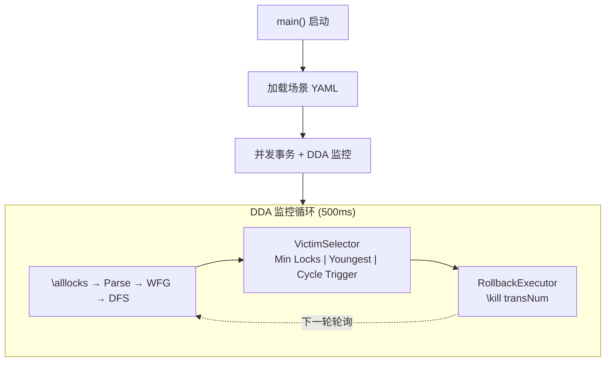
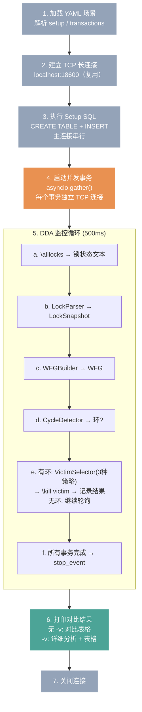

# DDA 阶段一设计规格

> 状态：已确认，待实施
> 日期：2026-06-12
> 范围：经典两事务死锁 → 三种固定规则 victim selection → 对比输出

## 1. 架构



**数据流**: YAML → 并发事务 → \alllocks → LockSnapshot → WFG(有向图) → DFS 找环 → Victim → \kill

**技术约束**: Python 3 + asyncio + 标准库（阶段二加 anthropic）

## 2. 场景定义

场景是 `scenarios.py` 中的 async 函数，每个函数：
- 负责建表、插数据（`_setup_database`）
- 用 `asyncio.gather` 启动并发事务（`_transaction`）
- 接受 `(host, port)`，返回执行结果 `dict`

第一个场景 `two_table_deadlock`: T1 先锁 dda_a 再锁 dda_b，T2 反向，形成 T1↔T2 死锁环。

> **历史注记**：最初设计用 YAML 配置文件定义场景，后续改为 Python 函数——脚本更灵活、不需要额外依赖。

## 3. 组件

> 组件详细设计见 [design.md](../../design.md) §3。此处仅列出阶段一的要点和差异。

| 组件 | 设计参考 | 阶段一要点 |
|------|---------|-----------|
| **PollingMonitor** | design.md §3.8 | 500ms 固定间隔，长连接复用，`stop_event` 控制退出 |
| **LockParser** | design.md §3.3 | 正则解析 `\alllocks`，输出 `LockSnapshot`（`held_locks` + `waiting` + `trans_times` + `raw_text`）|
| **WFGBuilder** | design.md §3.4 | `LockSnapshot` → `WaitForGraph`（`nodes` + `edges`），精确锁冲突检查 |
| **CycleDetector** | design.md §3.5 | DFS + 三色标记，返回 `list[Cycle]` |
| **VictimSelector** | design.md §3.6 | 三种策略：MinLocks / YoungestFirst / CycleTrigger，策略模式可切换 |
| **RollbackExecutor** | design.md §3.7 | 复用 DDA 连接发送 `\kill <transNum>` |

## 4. 主流程



## 5. 验收标准

- 死锁发生后 ≤1.5s 检测到（500ms × 3 个周期）
- 选定 victim 后 ≤500ms 完成 ROLLBACK
- 三种策略输出可对比
- 回滚后非 victim 事务继续执行并提交
- 被 kill 事务收到错误信息
- `python dda_basic.py` 一键启动，全程无手动干预
- 终端实时输出轮询状态、图结构、victim 选择、结果

## 6. 文件结构

```
dda/
├── dda_basic.py              # 主入口（CLI 参数、三种策略对比）
├── scenarios.py              # 死锁场景编排
├── test_components.py        # 组件级单元测试
├── test_integration.py       # 集成测试
├── dda/                      # 核心库
│   ├── __init__.py
│   ├── models.py             # 数据结构
│   ├── connection.py         # TCP 通信
│   ├── parser.py             # \alllocks 解析
│   ├── wfg.py                # Wait-for Graph 构造
│   ├── detector.py           # DFS 找环
│   ├── selector.py           # Victim 选择策略
│   ├── executor.py           # \kill 执行
│   └── monitor.py            # 主循环
├── requirements.txt
└── docs/
    ├── design.md             # 系统设计（含 Mermaid 配图）
    └── ...
```

## 7. 不做的事情

- 不做多场景配置（第一个场景硬编码路径，后面多了再拆）
- 不做自适应轮询（500ms 固定，记录到深挖路线图）
- 不做 LLM victim selection（阶段二）
- 不做 DDA 抽象化（BaseDeadlockDetector 等，记录到深挖路线图）
- 不写端到端集成测试（项目没有测试框架，阶段一以实际运行为验证；组件级单元测试已有 `test_components.py`）
